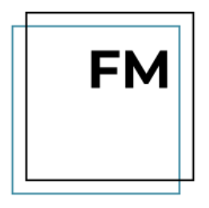
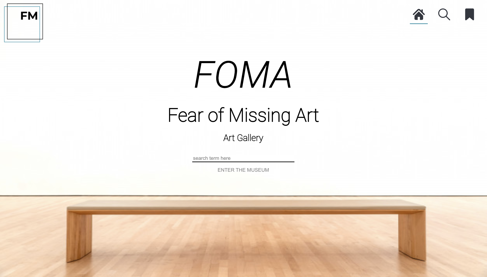
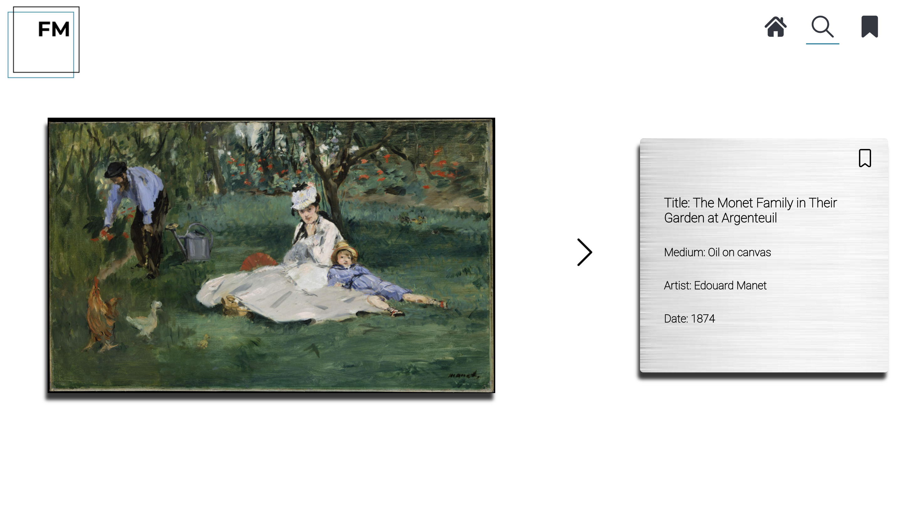
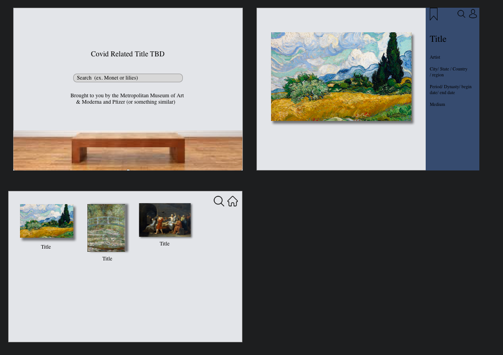
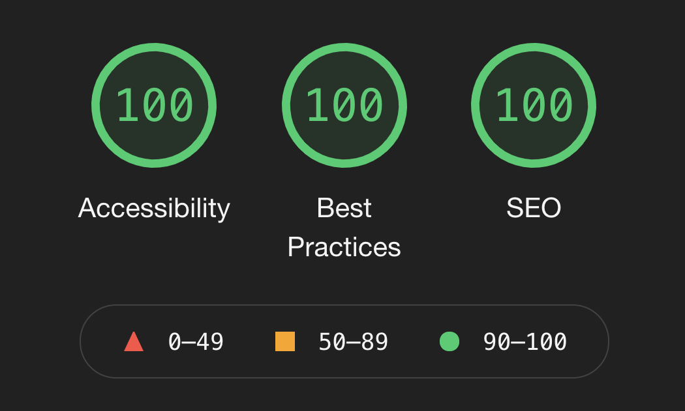

# FOMA: Fear of Missing Art 
<p align="center">

</p>  

## Table of Contents

- [About the Project](#about-the-project)
  - [Final Product](#final-product)
- [Project Goals](#project-goals)
- [Installation](#installation)
- [Technologies Used](#technologies-used)
- [Wireframes](#wireframes)
- [Functionality](#functionality)
  - [General](#general)
  - [Adding a Post](#adding-a-post)
  - [Search](#search)
  - [Error Handling](#error-handling)
  - [Accessibility](#accessibility)
- [Contact the Contributers](#contact-the-contributers)


## About the Project

FOMA: Fear of Missing Art is an art gallery targeted to people stuck inside due to Covid and ready to get out in the world. FOMA brings the gallery viewing experience to your home. It allows user to search through [the Metropolitan Museum of Art Collection](https://metmuseum.github.io/) using search terms such as artists, subject, keyword etc. and displays high-res images and details about each art piece. Users can also save their favorite pieces for later viewing. This solo project was a chance to build out a React app from scratch in 6 days using Router and Cypress for testing. 

Project spec ->
https://frontend.turing.edu/projects/module-3/niche-audience.html

#### Final Product:
##### Home Page:



##### Gallery View:


## Project Goals
1. Use the technology you’ve been working with over the course of the past 6 weeks to demonstrate mastery of the following:
 - React
 - Router
 - Asynchronous JavaScript
 - End to end testing with Cypress
 - Create personas and user stories to describe your target audience.

## Installation

View the code ->

Front-End:
https://github.com/PaigeVannelli/FOMA

API:
https://metmuseum.github.io/

Run:
1. clone this repository to your local machine using the command ```git clone```
2. CD into the project 
3. Install the dependancies using the command ```npm install```
4. Start the site using the command ```npm start```
5. To view the functioning tests run the command ```npm run cypress:open```

Deployed Link ->
https://foma-gallery.herokuapp.com/

## Technologies Used

- 

- 

- [](https://www.javascript.com/)

- 

- 

- 

## Wireframes
Sketch was utilized to create wireframes. We tested all user stories with our wireframes/prototypes to ensure that our designs catered to the needs of our users.



## Functionality

#### General
FOMA is an application that allows users to browse art based on their interest. When user first opene the app they are prompted to enter a search term. The term can be a favorite artists, topic, keyword etc. 


#### Art View
Users will then be taken to the gallery page to view their searched art. They can click through to see pieces displayed one at a time. 


#### Favoriting
Users can favorite different pieces of art on the gallery page and then view their favorited art pieces on the art page. 


#### Error Handling
Error handling was considered when building the website. A loading screen will appear when art is still being retrieved from the API. When a user wants to search for art, they must fill out the search field in order for the Enter the Museum button to activate. The user will know that the button is activated because it turns blue and is underlined. If a user searches a term that returns no art, they will receive a descriptive message prompting them to try a new search. 

#### Accessibility
FOMA received a 100% from Lighthouse on Accessibility. Users can tab throughout the full application, making it accessible for those using keyboards to navigate through.



## Contact the Contributer
[][linkedin3]
[][github3]

<!-- Personal Definitions  -->
[linkedin3]: https://www.linkedin.com/in/paigevannelli/
[github3]: https://github.com/PaigeVannelli
